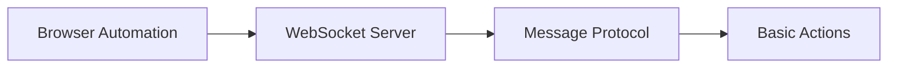
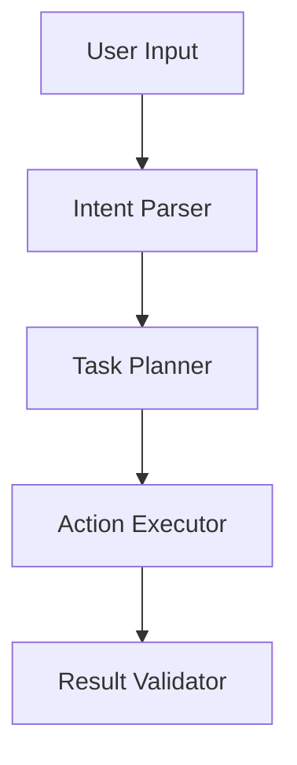

# Browser Agent Architecture Documentation

## Executive Summary

This document provides a comprehensive analysis of modern browser agent architectures, examining leading solutions like Perplexity's Comet, Manus AI, and OpenAI's Operator/ChatGPT Agent. It outlines the technical requirements, architecture patterns, and implementation strategies needed to build a sophisticated browser automation agent system.

## Table of Contents

1. [Market Analysis](#market-analysis)
2. [Existing Solutions Analysis](#existing-solutions-analysis)
3. [Core Architecture Components](#core-architecture-components)
4. [Technical Requirements](#technical-requirements)
5. [Implementation Strategy](#implementation-strategy)
6. [API Design and Protocols](#api-design-and-protocols)
7. [Development Roadmap](#development-roadmap)

## Market Analysis

### Current Landscape (2025)
- **Market Size**: The agentic AI market is projected to reach $196.6 billion by 2034, growing at 43.8% CAGR from $5.2 billion in 2024
- **Key Players**: OpenAI (Operator), Perplexity (Comet), Chinese startups (Manus), Anthropic (Claude Computer Use)
- **Technology Convergence**: All major players are racing to build the next intelligent interface that replaces traditional browser interactions

### Key Trends
1. **Vision-Based Automation**: Shift from DOM manipulation to visual understanding
2. **Multi-Model Orchestration**: Combining multiple AI models for specialized tasks
3. **Hybrid Architecture**: Balance between local processing and cloud-based AI
4. **Autonomous Task Execution**: Moving from reactive to proactive assistance

## Existing Solutions Analysis

### 1. Perplexity Comet

**Architecture Highlights:**
- Built on Chromium framework for cross-platform compatibility
- Hybrid approach: Local rendering + cloud AI processing
- Persistent context across sessions and tabs
- Agentic capabilities with autonomous task execution

**Key Features:**
- **Comet Assistant**: Lives as browser sidecar, understands page content
- **Multi-tab Context**: Maintains context across entire browsing session
- **Task Automation**: Can complete multi-step tasks (booking, comparing, emailing)
- **Document Processing**: Summarizes PDFs and long-form content instantly

**Limitations:**
- Hallucination issues with complex tasks
- Incorrect data entry in forms
- Limited availability (Perplexity Max subscribers only)

### 2. Manus AI

**Architecture Highlights:**
- CodeAct paradigm: Uses executable Python code instead of rigid JSON/tokens
- Linux sandbox environment for controlled execution
- Multi-agent orchestration (planning, knowledge retrieval, code generation)
- Transparent execution with "Manus's Computer" interface

**Technical Stack:**
- **Models**: Claude 3.5 Sonnet, Alibaba Qwen, open-source scaffolding
- **Environment**: Ubuntu, Python 3.10, Node.js 20, Unix utilities
- **Browser Automation**: Playwright/Selenium for headless browsing
- **Execution**: Iterative agent loop with event analysis and tool selection

**Performance:**
- State-of-the-art on GAIA benchmark (>65% score)
- Outperforms GPT-4 on real-world task automation
- Replayable sessions for debugging and review

### 3. OpenAI Operator/ChatGPT Agent

**Architecture Highlights:**
- Computer-Using Agent (CUA) model with GPT-4o vision
- Full Chrome instance running in cloud
- Unified agent system combining research and action
- Reinforcement learning for optimal strategy discovery

**Key Innovations:**
- **Vision-Based Control**: Screenshots + keyboard/mouse interactions
- **Browser-Level Automation**: Can use browser features (Ctrl+F, tabs)
- **Multi-Tool Orchestration**: Seamless switching between browser, terminal, APIs
- **Safety Mechanisms**: Monitor model, cautious navigation, detection pipeline

**Capabilities:**
- Deep research with multi-step workflows
- Visual browser environment interaction
- Code execution with terminal access
- External data source integration (Google Drive, etc.)

## Core Architecture Components

### 1. Browser Automation Layer

**Modern Standards:**
- **WebDriver BiDi**: Emerging standard combining WebDriver Classic + CDP
- **Chrome DevTools Protocol (CDP)**: Direct browser control, WebSocket-based
- **Playwright/Puppeteer**: High-level APIs with cross-browser support

**Implementation Considerations:**
```javascript
// Example architecture pattern
class BrowserController {
  constructor() {
    this.protocol = 'webdriver-bidi'; // Future-proof
    this.connection = new WebSocketConnection();
    this.sessionManager = new SessionStateManager();
  }
  
  async executeAction(action) {
    // Vision-based or DOM-based execution
    if (this.mode === 'vision') {
      return await this.visionExecutor.run(action);
    }
    return await this.domExecutor.run(action);
  }
}
```

### 2. AI Model Integration

**Multi-Model Architecture:**
```
┌─────────────────────────────────────┐
│         Orchestrator Agent          │
├─────────────────────────────────────┤
│  Planning │ Execution │ Validation  │
├───────────┼───────────┼─────────────┤
│   LLM 1   │   LLM 2   │    LLM 3    │
│ (Planning)│ (Action)  │ (Checking)  │
└───────────┴───────────┴─────────────┘
```

**Model Selection Strategy:**
- **Planning**: Large reasoning models (GPT-4, Claude)
- **Execution**: Fast, specialized models (fine-tuned)
- **Validation**: Safety-focused models with guardrails

### 3. Execution Environment

**Sandbox Architecture:**
```yaml
environment:
  type: "isolated-sandbox"
  components:
    - browser: "headless-chrome"
    - runtime: "node.js-20"
    - python: "3.10+"
    - filesystem: "virtual-fs"
  security:
    - network: "controlled-access"
    - permissions: "granular"
    - monitoring: "real-time"
```

### 4. State Management

**Context Persistence System:**
```typescript
interface StateManager {
  // Session state across tabs
  sessionContext: Map<TabId, PageContext>;
  
  // Task execution history
  executionHistory: TaskExecutionLog[];
  
  // User preferences and learning
  userProfile: UserPreferences;
  
  // Cross-session memory
  longTermMemory: VectorDatabase;
}
```

## Technical Requirements

### Core Capabilities

1. **Vision-Based Understanding**
   - Screenshot capture and analysis
   - Visual element detection
   - OCR for text extraction
   - Layout understanding

2. **Browser Control**
   - Mouse and keyboard simulation
   - Tab and window management
   - Navigation and history control
   - Download and upload handling

3. **Task Orchestration**
   - Multi-step workflow execution
   - Parallel task processing
   - Error recovery and retry logic
   - Progress tracking and reporting

4. **Context Management**
   - Cross-tab context sharing
   - Session persistence
   - Memory management
   - Context switching

### Performance Requirements

- **Latency**: <500ms for simple actions
- **Throughput**: Handle 100+ concurrent sessions
- **Accuracy**: >95% success rate for standard tasks
- **Scalability**: Horizontal scaling capability

### Security Requirements

1. **Isolation**
   - Sandboxed execution environment
   - Process isolation per session
   - Resource limits and quotas

2. **Authentication**
   - Secure credential storage
   - OAuth/SAML integration
   - Multi-factor authentication support

3. **Privacy**
   - Data encryption at rest and in transit
   - PII detection and masking
   - Audit logging and compliance

## Implementation Strategy

### Phase 1: Foundation (Weeks 1-4)



**Deliverables:**
- WebSocket communication layer
- Basic browser control (navigate, click, type)
- Screenshot capture and storage
- Simple action execution

### Phase 2: AI Integration (Weeks 5-8)



**Deliverables:**
- LLM integration for intent understanding
- Task planning and decomposition
- Action-to-browser-command mapping
- Basic error handling

### Phase 3: Advanced Features (Weeks 9-12)

**Deliverables:**
- Multi-tab context management
- Complex workflow automation
- Visual element detection
- Replayable session recording

### Phase 4: Production Ready (Weeks 13-16)

**Deliverables:**
- Performance optimization
- Security hardening
- Monitoring and analytics
- Documentation and testing

## API Design and Protocols

### WebSocket Protocol

```json
{
  "version": "1.0",
  "messages": {
    "task.execute": {
      "id": "unique-task-id",
      "type": "task.execute",
      "data": {
        "description": "Book a flight from NYC to LAX",
        "context": {},
        "options": {
          "timeout": 300000,
          "retries": 3
        }
      }
    },
    
    "task.status": {
      "id": "unique-task-id",
      "type": "task.status",
      "data": {
        "status": "in_progress",
        "step": 3,
        "total": 7,
        "currentAction": "Filling passenger details"
      }
    },
    
    "browser.action": {
      "type": "browser.action",
      "data": {
        "action": "click",
        "target": {
          "selector": "#submit-button",
          "screenshot": "base64-encoded-image"
        }
      }
    }
  }
}
```

### REST API Endpoints

```yaml
endpoints:
  /api/v1/tasks:
    POST: Create new task
    GET: List all tasks
    
  /api/v1/tasks/{id}:
    GET: Get task details
    DELETE: Cancel task
    
  /api/v1/sessions:
    POST: Create browser session
    GET: List active sessions
    
  /api/v1/sessions/{id}/screenshot:
    GET: Get current screenshot
    
  /api/v1/sessions/{id}/execute:
    POST: Execute browser action
```

### Agent Communication Protocol

```typescript
interface AgentMessage {
  messageId: string;
  timestamp: number;
  type: 'request' | 'response' | 'event';
  
  // For requests
  action?: {
    type: 'navigate' | 'click' | 'type' | 'extract' | 'wait';
    parameters: Record<string, any>;
  };
  
  // For responses
  result?: {
    success: boolean;
    data?: any;
    error?: string;
  };
  
  // For events
  event?: {
    type: 'page.load' | 'element.visible' | 'network.request';
    data: Record<string, any>;
  };
}
```

## Development Roadmap

### Milestone 1: MVP (Month 1)
- [ ] Basic browser automation
- [ ] Simple task execution
- [ ] WebSocket communication
- [ ] Error handling

### Milestone 2: AI Integration (Month 2)
- [ ] LLM integration
- [ ] Intent understanding
- [ ] Task planning
- [ ] Multi-step workflows

### Milestone 3: Advanced Features (Month 3)
- [ ] Vision-based control
- [ ] Context persistence
- [ ] Complex automation
- [ ] Performance optimization

### Milestone 4: Production Release (Month 4)
- [ ] Security audit
- [ ] Scalability testing
- [ ] Documentation
- [ ] Deployment pipeline

## Technology Stack Recommendations

### Core Technologies
- **Language**: TypeScript/Python hybrid
- **Browser Automation**: Playwright (cross-browser support)
- **AI Models**: OpenAI API + Local models (Ollama)
- **Communication**: WebSocket (Socket.io)
- **Database**: PostgreSQL + Redis
- **Vector Store**: Pinecone/Qdrant

### Infrastructure
- **Container**: Docker/Kubernetes
- **Cloud**: AWS/GCP with GPU instances
- **Monitoring**: Prometheus + Grafana
- **Logging**: ELK Stack
- **CI/CD**: GitHub Actions

## Implementation Best Practices

### 1. Modular Architecture
```
src/
├── core/
│   ├── browser/        # Browser automation
│   ├── ai/            # AI model integration
│   ├── execution/     # Task execution engine
│   └── state/         # State management
├── api/
│   ├── websocket/     # WebSocket handlers
│   ├── rest/          # REST endpoints
│   └── protocols/     # Message protocols
└── utils/
    ├── security/      # Security utilities
    ├── monitoring/    # Metrics and logging
    └── testing/       # Test utilities
```

### 2. Error Handling Strategy
- Implement exponential backoff for retries
- Graceful degradation for non-critical failures
- Comprehensive error logging and monitoring
- User-friendly error messages

### 3. Testing Approach
- Unit tests for core components
- Integration tests for workflows
- Visual regression testing
- Performance benchmarking
- Security penetration testing

### 4. Monitoring and Observability
- Real-time task execution metrics
- Browser resource utilization
- AI model performance tracking
- User interaction analytics
- Error rate monitoring

## Conclusion

Building a sophisticated browser agent requires careful orchestration of multiple technologies:
1. **Vision-based understanding** for universal web interaction
2. **Multi-model AI architecture** for specialized task handling
3. **Robust execution environment** with proper isolation
4. **Intelligent state management** for context persistence
5. **Comprehensive monitoring** for production reliability

The key to success lies in balancing automation capabilities with user control, ensuring transparency in execution, and maintaining high accuracy while handling edge cases gracefully.

## Appendix: Code Examples

### Example: Basic Task Executor

```typescript
class TaskExecutor {
  private browser: BrowserController;
  private ai: AIOrchestrator;
  private state: StateManager;
  
  async executeTask(task: Task): Promise<TaskResult> {
    // 1. Parse and understand intent
    const intent = await this.ai.parseIntent(task.description);
    
    // 2. Plan execution steps
    const plan = await this.ai.planSteps(intent, this.state.getContext());
    
    // 3. Execute each step
    for (const step of plan.steps) {
      try {
        // Take screenshot before action
        const screenshot = await this.browser.screenshot();
        
        // Determine action based on visual analysis
        const action = await this.ai.analyzeAndDecide(screenshot, step);
        
        // Execute browser action
        const result = await this.browser.execute(action);
        
        // Update state
        this.state.updateStep(step, result);
        
        // Validate result
        if (!await this.ai.validateStep(result, step.expectedOutcome)) {
          // Handle error or retry
          await this.handleStepError(step, result);
        }
      } catch (error) {
        await this.handleExecutionError(error, step);
      }
    }
    
    return this.prepareTaskResult(task, plan);
  }
}
```

### Example: WebSocket Handler

```typescript
class WebSocketHandler {
  private io: SocketIO.Server;
  private executor: TaskExecutor;
  
  setupHandlers() {
    this.io.on('connection', (socket) => {
      console.log('Client connected:', socket.id);
      
      socket.on('task.execute', async (data) => {
        const taskId = generateId();
        
        // Send immediate acknowledgment
        socket.emit('task.acknowledged', { taskId });
        
        // Execute task asynchronously
        this.executeTaskAsync(socket, taskId, data);
      });
      
      socket.on('browser.control', async (data) => {
        // Direct browser control for manual intervention
        const result = await this.handleBrowserControl(data);
        socket.emit('browser.result', result);
      });
    });
  }
  
  private async executeTaskAsync(socket: Socket, taskId: string, data: any) {
    try {
      // Create task execution stream
      const stream = this.executor.createStream(data);
      
      // Stream progress updates
      stream.on('progress', (progress) => {
        socket.emit('task.progress', { taskId, ...progress });
      });
      
      // Stream step completions
      stream.on('step', (step) => {
        socket.emit('task.step', { taskId, ...step });
      });
      
      // Wait for completion
      const result = await stream.execute();
      socket.emit('task.complete', { taskId, result });
      
    } catch (error) {
      socket.emit('task.error', { taskId, error: error.message });
    }
  }
}
```

This architecture provides a solid foundation for building a production-ready browser agent system that can compete with existing solutions while offering unique capabilities tailored to specific use cases.