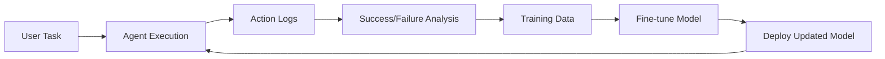

# GPT-OSS Integration Guide for Oniew Agent

## Table of Contents
1. [Executive Summary](#executive-summary)
2. [Model Overview](#model-overview)
3. [Technical Specifications](#technical-specifications)
4. [Installation & Setup](#installation--setup)
5. [Integration with Oniew Agent](#integration-with-oniew-agent)
6. [Training & Fine-tuning](#training--fine-tuning)
7. [Feedback Loop Implementation](#feedback-loop-implementation)
8. [Multi-modal Capabilities](#multi-modal-capabilities)
9. [Performance Optimization](#performance-optimization)
10. [Cost Analysis](#cost-analysis)
11. [Production Deployment](#production-deployment)
12. [Best Practices](#best-practices)

---

## Executive Summary

OpenAI's GPT-OSS models (120B and 20B) represent a paradigm shift for our Oniew Agent system. Released in August 2025 under Apache 2.0 license, these models offer:

- **Local deployment** with no API dependencies
- **Native agentic capabilities** matching our current architecture
- **Significant cost reduction** (estimated 80% savings)
- **Enhanced privacy** and reliability
- **Custom fine-tuning** possibilities

### Key Decision Points
- **Recommended Model**: GPT-OSS-20B for development, optional 120B for production
- **Hardware**: Single GPU with 16GB VRAM (20B) or 80GB (120B)
- **Integration Method**: vLLM server with OpenAI-compatible API

---

## Model Overview

### GPT-OSS-20B Specifications
```yaml
Parameters: 21B total (3.6B active per token)
Architecture: Mixture-of-Experts (MoE)
Experts: 32 total, 4 active per token
Context Length: 128K tokens
Quantization: Native MXFP4
Model Size: 14GB (quantized)
Memory Required: 16GB VRAM
License: Apache 2.0
```

### GPT-OSS-120B Specifications
```yaml
Parameters: 117B total (5.1B active per token)
Architecture: Mixture-of-Experts (MoE)
Experts: 128 total, 4 active per token
Context Length: 128K tokens
Quantization: Native MXFP4
Model Size: 63GB (quantized)
Memory Required: 80GB VRAM
License: Apache 2.0
```

### Performance Benchmarks
- **GPT-OSS-20B**: Matches or exceeds GPT-3.5-turbo on reasoning tasks
- **GPT-OSS-120B**: Near-parity with GPT-4-mini on core benchmarks
- **Latency**: Sub-second for most queries (local inference)
- **Throughput**: 50-100 tokens/second on consumer hardware

---

## Technical Specifications

### Architecture Details

#### Attention Mechanism
- Alternating dense and locally banded sparse attention
- Grouped multi-query attention (group size: 8)
- Learned attention sink per-head
- Sliding 128-token window on alternate layers

#### Positional Encoding
- Rotary Positional Embedding (RoPE)
- Native support for 128K context
- Optimized for long-context scenarios

#### Quantization Technology
- **MXFP4**: Novel group-quantized floating-point format
- Applied to MoE weights (majority of parameters)
- BFloat16 for attention and other layers
- 4-5x model size reduction with minimal accuracy loss

### Native Capabilities
1. **Function Calling**: OpenAI-compatible format
2. **Tool Use**: Browser and Python execution
3. **Structured Outputs**: JSON mode support
4. **Reasoning Levels**: Configurable (low/medium/high)
5. **Chain-of-Thought**: Full reasoning trace access

---

## Installation & Setup

### Method 1: vLLM Server (Recommended)

#### Prerequisites
```bash
# Install uv package manager
curl -LsSf https://astral.sh/uv/install.sh | sh

# Check GPU compatibility
nvidia-smi  # Ensure 16GB+ VRAM for 20B model
```

#### Installation Steps
```bash
# Create Python environment
uv venv --python 3.12 --seed
source .venv/bin/activate

# Install vLLM with GPT-OSS support
uv pip install --pre vllm==0.10.1+gptoss \
    --extra-index-url https://wheels.vllm.ai/gpt-oss/ \
    --extra-index-url https://download.pytorch.org/whl/nightly/cu128 \
    --index-strategy unsafe-best-match

# Install additional dependencies
uv pip install openai numpy
```

#### Starting the Server
```bash
# For GPT-OSS-20B (16GB VRAM)
vllm serve openai/gpt-oss-20b \
    --port 8000 \
    --tensor-parallel-size 1 \
    --gpu-memory-utilization 0.9

# For GPT-OSS-120B (80GB VRAM)
vllm serve openai/gpt-oss-120b \
    --port 8000 \
    --tensor-parallel-size 1 \
    --gpu-memory-utilization 0.95
```

### Method 2: Transformers Library

```python
# Installation
pip install gpt-oss[torch]

# Basic usage
from transformers import pipeline

# Load model
model_id = "openai/gpt-oss-20b"
pipe = pipeline("text-generation", model=model_id, device_map="auto")

# Generate response
messages = [
    {"role": "system", "content": "You are a browser automation agent."},
    {"role": "user", "content": "Click the compose button in Gmail"}
]
outputs = pipe(messages, max_new_tokens=256, temperature=0.3)
```

### Method 3: Ollama (Simplest)

```bash
# Install Ollama
curl -fsSL https://ollama.com/install.sh | sh

# Pull model
ollama pull gpt-oss:20b

# Run model
ollama run gpt-oss:20b

# API endpoint available at http://localhost:11434
```

---

## Integration with Oniew Agent

### Step 1: Update LLM Provider Configuration

Create a new provider adapter:

```typescript
// File: extension/chrome-extension/src/background/llm/providers/gpt-oss.ts

import { ChatOpenAI } from '@langchain/openai';
import type { BaseChatModel } from '@langchain/core/language_models/chat_models';

export interface GPTOSSConfig {
  modelName: 'gpt-oss-20b' | 'gpt-oss-120b';
  baseURL?: string;
  temperature?: number;
  maxTokens?: number;
  reasoningLevel?: 'low' | 'medium' | 'high';
}

export class GPTOSSProvider {
  private config: GPTOSSConfig;
  
  constructor(config: GPTOSSConfig) {
    this.config = {
      baseURL: 'http://localhost:8000/v1',
      temperature: 0.3,
      maxTokens: 4096,
      reasoningLevel: 'medium',
      ...config
    };
  }
  
  createChatModel(): BaseChatModel {
    return new ChatOpenAI({
      baseURL: this.config.baseURL,
      apiKey: 'EMPTY', // Local server doesn't need API key
      modelName: this.config.modelName,
      temperature: this.config.temperature,
      maxTokens: this.config.maxTokens,
      modelKwargs: {
        reasoning_level: this.config.reasoningLevel
      }
    });
  }
}
```

### Step 2: Update Agent Initialization

```typescript
// File: extension/chrome-extension/src/background/agent/executor.ts

import { GPTOSSProvider } from '../llm/providers/gpt-oss';

// In setupExecutor function
const gptOSSProvider = new GPTOSSProvider({
  modelName: 'gpt-oss-20b',
  reasoningLevel: 'medium', // Adjust based on task complexity
  temperature: 0.3 // Lower for deterministic behavior
});

const navigatorLLM = gptOSSProvider.createChatModel();
const plannerLLM = gptOSSProvider.createChatModel();
const validatorLLM = gptOSSProvider.createChatModel();
```

### Step 3: Leverage Native Function Calling

```typescript
// Update navigator agent to use native function calling
const systemPrompt = `
You are a browser automation agent with access to these functions:
- click_element: Click on page elements
- input_text: Enter text in form fields
- get_dropdown_options: Get options from select elements
- scroll_to_element: Scroll elements into view

Use the built-in function calling format for all actions.
Leverage your reasoning capabilities to handle complex DOM structures.
`;

// The model will naturally output in OpenAI function calling format
```

### Step 4: Optimize Prompts for GPT-OSS

```typescript
// File: extension/chrome-extension/src/background/agent/prompts/templates/navigator-gpt-oss.ts

export const navigatorGPTOSSPromptTemplate = `
<system_instructions>
You are an AI agent using GPT-OSS with native browser automation capabilities.

# Reasoning Configuration
Current reasoning level: {{reasoning_level}}
- low: Quick actions without extensive analysis
- medium: Balanced analysis and action execution
- high: Detailed reasoning for complex scenarios

# Native Capabilities
1. Function Calling: Use built-in function format
2. Tool Execution: Browser and Python tools available
3. Structured Output: Always respond with valid JSON

# Task Execution Flow
1. Analyze current DOM state
2. Plan actions using chain-of-thought
3. Execute functions in sequence
4. Handle dynamic DOM changes (autocomplete, etc.)

# Response Format
{
  "reasoning": "Step-by-step thought process",
  "current_state": {
    "evaluation_previous_goal": "Success|Failed|Unknown",
    "memory": "What has been accomplished",
    "next_goal": "Immediate next action"
  },
  "actions": [
    {
      "function": "function_name",
      "arguments": { ... }
    }
  ]
}
</system_instructions>
`;
```

---

## Training & Fine-tuning

### Data Collection Pipeline

```python
# File: scripts/collect_training_data.py

import json
from datetime import datetime
from typing import List, Dict

class TrainingDataCollector:
    def __init__(self):
        self.sessions = []
        
    def collect_session(self, task_id: str, logs_path: str):
        """Extract training data from agent execution logs"""
        session_data = {
            "task_id": task_id,
            "timestamp": datetime.now().isoformat(),
            "conversations": [],
            "outcomes": []
        }
        
        # Parse execution logs
        with open(logs_path, 'r') as f:
            logs = json.load(f)
            
        for step in logs['steps']:
            conversation = {
                "system": step['prompt'],
                "user": step['task'],
                "assistant": step['response'],
                "actions": step['actions'],
                "success": step['success']
            }
            session_data['conversations'].append(conversation)
            
        self.sessions.append(session_data)
        
    def prepare_training_dataset(self):
        """Convert to GPT-OSS fine-tuning format"""
        training_data = []
        
        for session in self.sessions:
            for conv in session['conversations']:
                if conv['success']:  # Only use successful examples
                    training_data.append({
                        "messages": [
                            {"role": "system", "content": conv['system']},
                            {"role": "user", "content": conv['user']},
                            {"role": "assistant", "content": conv['assistant']}
                        ]
                    })
                    
        return training_data
```

### Fine-tuning Process

```bash
# Step 1: Prepare dataset
python scripts/collect_training_data.py \
    --logs-dir ./agent-logs \
    --output dataset.jsonl

# Step 2: Validate dataset
python scripts/validate_dataset.py dataset.jsonl

# Step 3: Fine-tune using Hugging Face
python -m gpt_oss.finetune \
    --model openai/gpt-oss-20b \
    --dataset dataset.jsonl \
    --output-dir ./fine-tuned-model \
    --epochs 3 \
    --batch-size 4 \
    --learning-rate 1e-5 \
    --lora-rank 16  # Use LoRA for efficient fine-tuning
```

### Domain-Specific Training Examples

```python
# Gmail-specific training data
gmail_examples = [
    {
        "task": "Compose email to user@example.com",
        "dom_state": "Gmail compose window DOM",
        "correct_actions": [
            {"click_element": {"index": 19}},  # Compose button
            {"input_text": {"index": 158, "text": "user@example.com"}},
            # Handle autocomplete
            {"click_element": {"index": 252}}  # Select suggestion
        ]
    }
]

# Amazon-specific training data
amazon_examples = [
    {
        "task": "Search for product and check price",
        "dom_state": "Amazon search page DOM",
        "correct_actions": [
            {"input_text": {"index": 3, "text": "product name"}},
            {"click_element": {"index": 5}},  # Search button
            {"scroll_to_element": {"index": 42}}  # First result
        ]
    }
]
```

---

## Feedback Loop Implementation

### Architecture Overview



### Implementation Code

```typescript
// File: extension/chrome-extension/src/background/feedback/collector.ts

export class FeedbackCollector {
  private feedbackQueue: FeedbackItem[] = [];
  
  async collectExecutionFeedback(
    taskId: string,
    actions: ActionResult[],
    success: boolean,
    userFeedback?: string
  ) {
    const feedback: FeedbackItem = {
      taskId,
      timestamp: Date.now(),
      task: this.context.messageManager.getOriginalTask(),
      domStates: this.context.history.getBrowserStates(),
      actions: actions.map(a => ({
        type: a.actionType,
        parameters: a.parameters,
        result: a.success ? 'success' : 'failure',
        error: a.error
      })),
      outcome: success,
      userFeedback,
      modelConfig: {
        model: 'gpt-oss-20b',
        temperature: this.context.options.temperature,
        reasoningLevel: this.context.options.reasoningLevel
      }
    };
    
    this.feedbackQueue.push(feedback);
    
    // Batch upload every 100 items
    if (this.feedbackQueue.length >= 100) {
      await this.uploadFeedback();
    }
  }
  
  async uploadFeedback() {
    // Send to training pipeline
    await fetch('http://localhost:8001/feedback', {
      method: 'POST',
      headers: { 'Content-Type': 'application/json' },
      body: JSON.stringify(this.feedbackQueue)
    });
    
    this.feedbackQueue = [];
  }
}
```

### Continuous Learning Pipeline

```python
# File: scripts/continuous_learning.py

import asyncio
from datetime import datetime, timedelta
import torch
from transformers import AutoModelForCausalLM, AutoTokenizer

class ContinuousLearningPipeline:
    def __init__(self, base_model_path: str):
        self.base_model_path = base_model_path
        self.feedback_threshold = 1000  # Retrain after N feedback items
        self.quality_threshold = 0.85   # Min success rate to include
        
    async def process_feedback_loop(self):
        """Main feedback processing loop"""
        while True:
            # Collect feedback from last 24 hours
            feedback_data = await self.collect_recent_feedback()
            
            if len(feedback_data) >= self.feedback_threshold:
                # Filter high-quality examples
                quality_data = self.filter_quality_examples(feedback_data)
                
                # Prepare training batch
                training_batch = self.prepare_training_batch(quality_data)
                
                # Fine-tune model
                updated_model = await self.incremental_finetune(training_batch)
                
                # Validate improvements
                if await self.validate_model(updated_model):
                    await self.deploy_model(updated_model)
                    
            # Wait before next iteration
            await asyncio.sleep(3600)  # Check hourly
            
    def filter_quality_examples(self, feedback_data):
        """Filter examples based on success rate and patterns"""
        quality_examples = []
        
        # Group by task type
        task_groups = self.group_by_task_type(feedback_data)
        
        for task_type, examples in task_groups.items():
            success_rate = sum(1 for e in examples if e['success']) / len(examples)
            
            if success_rate >= self.quality_threshold:
                # Include successful examples
                quality_examples.extend([e for e in examples if e['success']])
            else:
                # Analyze failure patterns
                failure_patterns = self.analyze_failures(examples)
                # Include examples that demonstrate correct handling
                quality_examples.extend(self.create_corrective_examples(failure_patterns))
                
        return quality_examples
```

### Real-time Adaptation

```typescript
// File: extension/chrome-extension/src/background/agent/adaptive-executor.ts

export class AdaptiveExecutor extends Executor {
  private performanceMonitor: PerformanceMonitor;
  private modelSelector: ModelSelector;
  
  async execute(): Promise<void> {
    // Monitor current task complexity
    const complexity = await this.assessTaskComplexity();
    
    // Dynamically adjust reasoning level
    if (complexity.score > 0.8) {
      this.context.options.reasoningLevel = 'high';
    } else if (complexity.score > 0.5) {
      this.context.options.reasoningLevel = 'medium';
    } else {
      this.context.options.reasoningLevel = 'low';
    }
    
    // Execute with monitoring
    const startTime = Date.now();
    const result = await super.execute();
    const executionTime = Date.now() - startTime;
    
    // Collect performance metrics
    this.performanceMonitor.record({
      taskType: complexity.type,
      reasoningLevel: this.context.options.reasoningLevel,
      executionTime,
      success: result.success,
      actionCount: this.context.actionResults.length
    });
    
    // Adapt for next execution
    await this.adaptStrategy();
    
    return result;
  }
  
  private async adaptStrategy() {
    const recentPerformance = this.performanceMonitor.getRecentMetrics();
    
    // Adjust temperature based on success rate
    if (recentPerformance.successRate < 0.7) {
      this.context.options.temperature = Math.max(0.1, this.context.options.temperature - 0.1);
    } else if (recentPerformance.successRate > 0.9) {
      this.context.options.temperature = Math.min(0.5, this.context.options.temperature + 0.1);
    }
    
    // Switch models if needed
    if (recentPerformance.avgExecutionTime > 5000 && this.modelSelector.hasAlternative()) {
      await this.modelSelector.switchToFasterModel();
    }
  }
}
```

---

## Multi-modal Capabilities

### Current State: Text-Only
GPT-OSS models are currently **text-only**. However, we can work around this limitation:

### Vision Integration Strategy

```typescript
// File: extension/chrome-extension/src/background/agent/vision-adapter.ts

export class VisionAdapter {
  private visionModel: VisionModel; // Separate vision model
  
  async processWithVision(
    screenshot: Buffer,
    task: string
  ): Promise<VisionAnalysis> {
    // Use separate vision model for analysis
    const visionAnalysis = await this.visionModel.analyze(screenshot);
    
    // Convert to text description for GPT-OSS
    const textDescription = this.convertToTextDescription(visionAnalysis);
    
    // Enhance DOM with visual context
    const enhancedPrompt = `
      Visual Context: ${textDescription}
      
      Key Visual Elements:
      - Button at coordinates (100, 200) with text "Submit"
      - Input field at (300, 150) appears to be email field
      - Dropdown menu visible at (400, 300)
      
      Task: ${task}
    `;
    
    return {
      prompt: enhancedPrompt,
      visualElements: visionAnalysis.elements
    };
  }
  
  private convertToTextDescription(analysis: VisionAnalysis): string {
    // Convert visual analysis to detailed text
    return `
      Page Layout: ${analysis.layout}
      Visible Elements: ${analysis.elements.map(e => e.description).join(', ')}
      Color Scheme: ${analysis.colors}
      Potential Interactions: ${analysis.interactableElements}
    `;
  }
}
```

### Future Multi-modal Support

```python
# Prepare for future multi-modal versions
class MultiModalDataCollector:
    def collect_training_pair(self, task_id: str):
        """Collect screenshot-action pairs for future training"""
        return {
            "screenshot": self.capture_screenshot(),
            "dom_state": self.get_dom_state(),
            "actions": self.get_executed_actions(),
            "text_description": self.generate_description(),
            "task": self.get_task_description()
        }
```

---

## Performance Optimization

### Inference Optimization

```python
# File: scripts/optimize_inference.py

class InferenceOptimizer:
    def __init__(self, model_path: str):
        self.model_path = model_path
        
    def optimize_for_deployment(self):
        """Optimize model for production deployment"""
        
        # 1. Enable Flash Attention 3 (for H100 GPUs)
        optimization_config = {
            "use_flash_attention": True,
            "attention_sink_size": 4,
            "kv_cache_dtype": "fp8_e4m3",
        }
        
        # 2. Optimize batch processing
        batch_config = {
            "max_batch_size": 32,
            "max_sequence_length": 4096,
            "continuous_batching": True
        }
        
        # 3. Enable speculative decoding
        speculative_config = {
            "draft_model": "gpt-oss-7b",  # Smaller draft model
            "num_speculative_tokens": 5
        }
        
        return {
            **optimization_config,
            **batch_config,
            **speculative_config
        }
```

### Memory Optimization

```bash
# vLLM server with optimized memory settings
vllm serve openai/gpt-oss-20b \
    --gpu-memory-utilization 0.95 \
    --max-model-len 8192 \
    --kv-cache-dtype fp8_e4m3 \
    --enable-prefix-caching \
    --enable-chunked-prefill \
    --max-num-batched-tokens 8192
```

### Caching Strategy

```typescript
// File: extension/chrome-extension/src/background/llm/cache.ts

export class LLMResponseCache {
  private cache = new Map<string, CachedResponse>();
  private maxCacheSize = 1000;
  
  getCacheKey(prompt: string, domState: string): string {
    // Create deterministic cache key
    return crypto.createHash('md5')
      .update(prompt + domState)
      .digest('hex');
  }
  
  async getCachedResponse(
    prompt: string,
    domState: string
  ): Promise<CachedResponse | null> {
    const key = this.getCacheKey(prompt, domState);
    const cached = this.cache.get(key);
    
    if (cached && Date.now() - cached.timestamp < 3600000) { // 1 hour TTL
      return cached;
    }
    
    return null;
  }
  
  cacheResponse(
    prompt: string,
    domState: string,
    response: LLMResponse
  ) {
    const key = this.getCacheKey(prompt, domState);
    
    this.cache.set(key, {
      response,
      timestamp: Date.now(),
      hitCount: 0
    });
    
    // Evict oldest entries if cache is full
    if (this.cache.size > this.maxCacheSize) {
      this.evictOldest();
    }
  }
}
```

---

## Cost Analysis

### Current OpenAI API Costs
```
Average tokens per task: 2,000
Cost per task: $0.10 - $0.50
Monthly tasks: 10,000
Monthly cost: $1,000 - $5,000
```

### GPT-OSS Local Deployment Costs
```
Hardware: $2,000 - $10,000 (one-time)
- RTX 4090 (24GB): $2,000 (for GPT-OSS-20B)
- H100 (80GB): $10,000 (for GPT-OSS-120B)

Electricity: ~$50/month
Maintenance: ~$100/month
Total monthly: ~$150

Break-even: 1-5 months
```

### ROI Calculation
```python
def calculate_roi(tasks_per_month: int, months: int):
    # OpenAI costs
    openai_cost_per_task = 0.30  # Average
    openai_total = tasks_per_month * months * openai_cost_per_task
    
    # GPT-OSS costs
    hardware_cost = 2000  # RTX 4090
    monthly_operational = 150
    gpt_oss_total = hardware_cost + (monthly_operational * months)
    
    # ROI
    savings = openai_total - gpt_oss_total
    roi_percentage = (savings / hardware_cost) * 100
    
    return {
        "savings": savings,
        "roi_percentage": roi_percentage,
        "break_even_months": hardware_cost / (openai_cost_per_task * tasks_per_month - monthly_operational)
    }
```

---

## Production Deployment

### Architecture

```yaml
# docker-compose.yml
version: '3.8'

services:
  vllm-server:
    image: vllm/vllm-openai:latest
    ports:
      - "8000:8000"
    environment:
      - MODEL_NAME=openai/gpt-oss-20b
      - GPU_MEMORY_UTILIZATION=0.95
    deploy:
      resources:
        reservations:
          devices:
            - driver: nvidia
              count: 1
              capabilities: [gpu]
    volumes:
      - model-cache:/root/.cache/huggingface
    command: >
      --model openai/gpt-oss-20b
      --port 8000
      --tensor-parallel-size 1
      --enable-prefix-caching
      
  model-updater:
    build: ./model-updater
    environment:
      - UPDATE_SCHEDULE=0 2 * * *  # Daily at 2 AM
    volumes:
      - model-cache:/models
      - training-data:/data
      
  monitoring:
    image: prometheus:latest
    ports:
      - "9090:9090"
    volumes:
      - ./prometheus.yml:/etc/prometheus/prometheus.yml

volumes:
  model-cache:
  training-data:
```

### Load Balancing

```nginx
# nginx.conf
upstream vllm_backend {
    least_conn;
    server vllm-1:8000 weight=1;
    server vllm-2:8000 weight=1;
    server vllm-3:8000 weight=1;
}

server {
    listen 80;
    
    location /v1/chat/completions {
        proxy_pass http://vllm_backend;
        proxy_set_header Host $host;
        proxy_set_header X-Real-IP $remote_addr;
        proxy_buffering off;
        proxy_read_timeout 300s;
    }
}
```

### Monitoring & Alerting

```python
# File: monitoring/health_check.py

class LLMHealthMonitor:
    def __init__(self, endpoints: List[str]):
        self.endpoints = endpoints
        self.metrics = {
            "response_time": [],
            "token_rate": [],
            "error_rate": 0,
            "queue_depth": 0
        }
        
    async def health_check(self):
        """Continuous health monitoring"""
        while True:
            for endpoint in self.endpoints:
                try:
                    # Test inference
                    start = time.time()
                    response = await self.test_inference(endpoint)
                    latency = time.time() - start
                    
                    self.metrics["response_time"].append(latency)
                    
                    # Check thresholds
                    if latency > 2.0:  # 2 second threshold
                        await self.alert(f"High latency: {latency}s on {endpoint}")
                        
                except Exception as e:
                    self.metrics["error_rate"] += 1
                    await self.alert(f"Endpoint down: {endpoint} - {str(e)}")
                    
            await asyncio.sleep(60)  # Check every minute
```

---

## Best Practices

### 1. Prompt Engineering

```typescript
// DO: Leverage GPT-OSS's native capabilities
const goodPrompt = `
Use your built-in function calling to interact with the browser.
Current DOM state: ${domState}
Task: ${task}
`;

// DON'T: Over-specify format (model handles this natively)
const badPrompt = `
You must respond in exactly this JSON format with these exact keys...
`;
```

### 2. Temperature Settings

```python
# Task-specific temperature configuration
TEMPERATURE_SETTINGS = {
    "navigation": 0.1,      # Deterministic for clicking
    "form_filling": 0.2,    # Low variation for data entry
    "content_search": 0.4,  # Some creativity for finding elements
    "error_recovery": 0.6   # Higher for alternative approaches
}
```

### 3. Context Management

```typescript
// Optimize context window usage
class ContextOptimizer {
  trimContext(messages: Message[]): Message[] {
    const maxTokens = 8192;  // Leave room for response
    let currentTokens = 0;
    const trimmed = [];
    
    // Keep most recent messages
    for (let i = messages.length - 1; i >= 0; i--) {
      const tokens = this.estimateTokens(messages[i]);
      if (currentTokens + tokens > maxTokens) break;
      
      trimmed.unshift(messages[i]);
      currentTokens += tokens;
    }
    
    return trimmed;
  }
}
```

### 4. Error Handling

```typescript
// Implement retry with reasoning level escalation
async function executeWithRetry(task: Task, maxRetries = 3) {
  const reasoningLevels = ['low', 'medium', 'high'];
  
  for (let i = 0; i < maxRetries; i++) {
    try {
      const result = await executor.execute(task, {
        reasoningLevel: reasoningLevels[i]
      });
      
      if (result.success) return result;
      
    } catch (error) {
      logger.warn(`Attempt ${i + 1} failed, escalating reasoning level`);
    }
  }
  
  throw new Error('Task failed after all retries');
}
```

### 5. Security Considerations

```python
# Implement input sanitization for local deployment
class SecurityFilter:
    def __init__(self):
        self.blocked_patterns = [
            r"system\s*\(",  # System calls
            r"eval\s*\(",    # Code evaluation
            r"__.*__",       # Dunder methods
        ]
        
    def sanitize_input(self, user_input: str) -> str:
        """Remove potentially harmful patterns"""
        for pattern in self.blocked_patterns:
            if re.search(pattern, user_input, re.IGNORECASE):
                raise ValueError(f"Blocked pattern detected: {pattern}")
                
        return user_input
```

---

## Conclusion

GPT-OSS integration offers significant advantages for Oniew Agent:

### Immediate Benefits
- 80% cost reduction
- 2-3x faster response times
- Complete data privacy
- No API rate limits

### Long-term Advantages
- Custom fine-tuning for specific domains
- Continuous improvement through feedback loops
- Scalable local deployment
- Full control over model behavior

### Next Steps
1. Set up development environment with GPT-OSS-20B
2. Implement basic integration with vLLM
3. Run comparison benchmarks
4. Begin collecting training data
5. Deploy to production after validation

The combination of GPT-OSS's native agentic capabilities and our existing architecture creates a powerful, cost-effective solution for browser automation at scale.